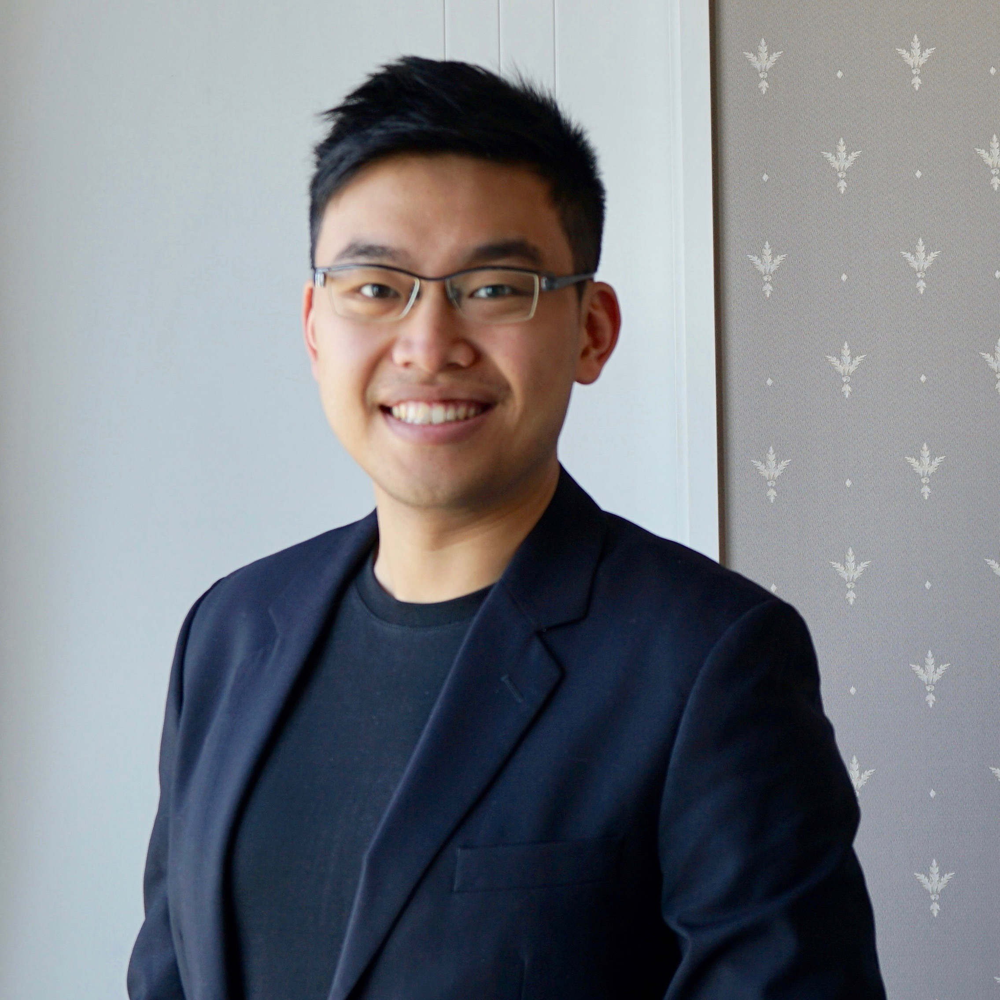

---
# Feel free to add content and custom Front Matter to this file.
# To modify the layout, see https://jekyllrb.com/docs/themes/#overriding-theme-defaults

layout: default
title: Home
---

    <!-- your picture should not exceed a width of 240px, preferably 239px, otherwise internet explorer 8 (and maybe other version) does not disply the website correctly-->
    
    <!-- 
Phone: +44 (0)20 7955 1111
 -->
    
<i class="fa fa-envelope"></i>: gromit.y.chan(at)gmail(dot)com

    
<i class="fa fa-twitter"></i>: <a href="https://twitter.com/GromitC">GromitC</a> <i class="fa fa-graduation-cap"></i>: <a href="https://scholar.google.com/citations?user=t7tR7O0AAAAJ">Google Scholar</a>

    
<iframe height='250' width='240' frameborder='0' allowtransparency='true' scrolling='yes' src='https://www.strava.com/athletes/63539277/latest-rides/81f565dfb3a712eaf25c3e507e6bed5c2ac496f5'></iframe>

    
Welcome

    
News:

    
10/21: I will serve as a Program Committee in the Web Conference 2022.

   
About Me:

    My name is Gromit Yeuk-Yin CHAN  (陳若然), a Research Scientist in Adobe Research. 
     
    I received my PhD in New York University in 2021, a BEng in Computer Engineering and a BBA in General Business Management in The Hong Kong University of Science and Technology in 2016. I was a member in <a target="_blank" href="http://vgc.poly.edu/wiki/vgc/index.php/Main_Page">Visualization and Data Analytics (ViDA) lab</a>, and I was a member in <a target="_blank" href="http://vis.cse.ust.hk/vislab_homepage/people.html">HKUST VisLab</a> in my last year of undergraduate study.
      
    I am broadly interested in the machine learning aspect of interactive visualization. Recently I have been working on large scale data summarization and interactive systems using sketching algorithms. My PhD advisors are <a target="_blank" href="https://vgc.poly.edu/~csilva/">prof. Claudio T. Silva</a> and <a target="_blank" href="https://vgc.poly.edu/~juliana/">prof. Juliana Freire</a>, and I am fortunate to spend a decent amount of time working with <a target="_blank" href="http://www.icmc.usp.br/~gnonato/">prof. Gustavo Nonato</a>, <a target="_blank" href="http://www.harishd.com/home/">Dr. Harish Doraiswamy</a>, <a target="_blank" href="http://lliquid.github.io/homepage/">Dr. Panpan Xu</a>, <a target="_blank" href="http://helios.mi.parisdescartes.fr/~themisp/">prof. Themis Palpanas</a>, <a target="_blank" href="http://frankdu.org/">Dr. Fan Du<a/> and <a target="_blank" href="https://sites.google.com/view/tungtmai/">Dr. Tung Mai<a/>.
     
    I come from Hong Kong, where <a target="_blank" href="https://edition.cnn.com/travel/article/hong-kong-worlds-greatest-city/index.html">CNN gives 40 reasons to prove why it is a colorful, chaotic, fantastic place to live and visit</a>. 
    
Research Interests:

    Visualization, Data Management     
<!-- 
 -->