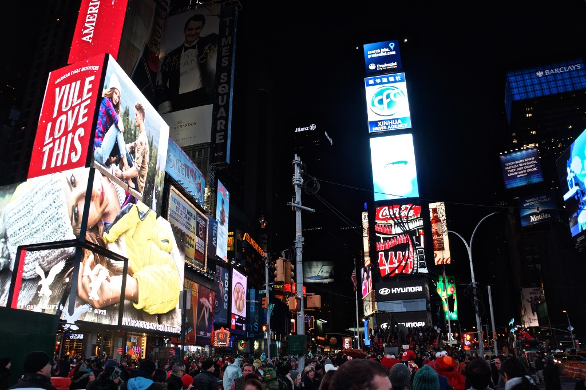

	
Some Videos

	<h5> I was selected to present my work on email editing in Adobe Journey Optimizer with Kristen Bell at Adobe Summit Sneaks 2022. Part of the work were also presented at CHI LBW in the same year.</h5>
	<iframe width="700" height="394" src="https://www.youtube.com/embed/o8azsdA0ozU?si=gE3ejkYbcmcmMW9H" title="YouTube video player" frameborder="0" allow="accelerometer; autoplay; clipboard-write; encrypted-media; gyroscope; picture-in-picture; web-share" allowfullscreen></iframe>
	<h5> Two years later, my work on infogrpahics editing with my intern Tongyu Zhou was selected to be presented at Summit Sneaks again. It was the only intern work selected to be presented and Tongyu did an amazing job to show Shaq how cool infographics could be! The work was also accepted as a regular CHI paper in the same year.</h5>
	<iframe width="700" height="394" src="https://www.youtube.com/embed/XSMO9-7pcq8?si=JHEnwRs5MI9vB6NG" title="YouTube video player" frameborder="0" allow="accelerometer; autoplay; clipboard-write; encrypted-media; gyroscope; picture-in-picture; web-share" referrerpolicy="strict-origin-when-cross-origin" allowfullscreen></iframe>

	
Some Traveling Photos:

	<!-- Slideshow container -->

  <!-- Full-width images with number and caption text -->
  

    
    
Bryce Canyon

    
    
Boston

    
    
Duluth

    
    
Grand Canyon

    
    
Kyoto

    
    
Monterey

    
    
Machu Picchu

    
    
Nikko

    
    
New York

    
    
Seattle

    
    
San Francisco

    
    
Singapore

    
    
Yellowstone

    
    
Utah

    
    
Yosemite

    
    
Sichuan

  <!-- Next and previous buttons -->
  <a class="prev" onclick="plusSlides(-1)">&#10094;</a>
  <a class="next" onclick="plusSlides(1)">&#10095;</a>

